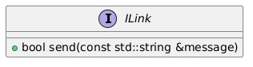

# Interface *ILink*
This repo consists of an interface component *ILink*. It is a part of example application *[broker](https://github.com/slawomir-niespodziany/diff_broker)*, which demonstrates the use of *[diff](https://github.com/slawomir-niespodziany/diff)* framework. 

*ILink* is further implemented by components which provide functionality of message sending. See broker repo for more details.

<p align="center"><a href="include/ILink.h"></a></p>

## Installation
*It is recommended to build and run the whole demo app at once, by following the guide in *[broker](https://github.com/slawomir-niespodziany/diff_broker)* repo. If you only want to install this single component, then proceed with this document.*

This is an interface component. It consists only of header files, thus it needs not to be built. However, it shall be installed so that other components depending on it may include those headers.

The following command can be run from within the component directory. It installs the component in your local CMake registry.
```
cmake -Bbuild -DCMAKE_EXPORT_PACKAGE_REGISTRY=ON
```

## Prerequisites
The whole demo has been prepared and tested on Ubuntu 22.04 and Ubuntu 24.04. That being said, you only need *cmake* to install this component. The latest version (*cmake 4.0.1*) can be installed using the following command.
```
sudo snap install cmake --classic
```
